<div align="center">

# RotaFibra

**App de campo para documentar rotas de fibra óptica (FTTH). Funciona sem internet.**

Os técnicos marcam postes, CTOs e CEOs e lançam o cabo poste a poste, direto no celular. O escritório acompanha a rede e o histórico num painel web.

[](https://github.com/RicardoMedeiros1/ftthfist/actions/workflows/deploy.yml)


[Abrir o app](https://ricardomedeiros1.github.io/ftthfist/) (login e aprovação necessários) · [Telas](#telas) · [Documentação](#documentação) · [Guia de testes](docs/guia-de-testes.md)

> [!IMPORTANT]
> **Software proprietário, de uso privado.** O código, os dados e a documentação são confidenciais e **todos os direitos são reservados**. Não é permitido usar, copiar, modificar, distribuir ou publicar nada daqui sem autorização prévia e por escrito do titular. Ver o código não dá licença nenhuma. Termos completos em [`LICENSE`](LICENSE).

</div>

---

## Sumário

- [Sobre](#sobre)
- [Princípios](#princípios)
- [Funcionalidades](#funcionalidades)
- [Telas](#telas)
- [Como funciona](#como-funciona)
- [Stack](#stack)
- [Começando](#começando)
- [Backend (Supabase)](#backend-supabase)
- [Publicação](#publicação)
- [Testes](#testes)
- [Estrutura do projeto](#estrutura-do-projeto)
- [Documentação](#documentação)
- [Status e próximos passos](#status-e-próximos-passos)
- [Segurança](#segurança)
- [Contribuindo](#contribuindo)
- [Licença](#licença)

## Sobre

O RotaFibra nasceu num provedor de internet (FTTH, EPON/GPON) no Brasil. Os técnicos de estrutura o usam no celular, em campo, para registrar:

- **Implantação:** por onde o cabo de fibra passa, poste a poste, com CTOs, CEOs, reservas e fotos.
- **Manutenção:** o que foi feito em cada atendimento (ocorrências, materiais, fotos).

O escritório (NOC) vê a rede e o histórico de todos os técnicos num painel web, e o administrador designa projetos, desenha o traçado esperado e aprova as pessoas.

A interface é **100% em português do Brasil**; o código (variáveis, funções, tabelas) é em inglês.

## Princípios

Estas regras guiam todas as decisões do projeto.

| # | Princípio | Na prática |
|---|---|---|
| 1 | **Offline-first** | Tudo é salvo primeiro no aparelho (IndexedDB). Nenhuma ação de campo depende de internet; a sincronização acontece depois. |
| 2 | **O cabo é desenhado poste a poste** | O traçado liga elementos marcados. A trilha GPS é um registro de deslocamento separado e **nunca** vira cabo sozinha. |
| 3 | **Precisão visível** | Todo ponto de GPS guarda a precisão em metros. Acima de 15 m o app avisa e oferece ajustar o ponto arrastando sobre o satélite. |
| 4 | **Feito para campo** | Mobile-first, botões de no mínimo 48 px, alto contraste (legível no sol), uso com uma mão (barra de abas e botão MARCAR ao alcance do polegar), dois temas de cor, poucos toques e confirmação antes de excluir. |
| 5 | **Sem credenciais no frontend** | No app só existe a chave pública do Supabase, protegida por RLS. |
| 6 | **Exclusão sempre lógica** | `deleted = true`, nunca `DELETE`, para não quebrar a sincronização. |

## Funcionalidades

### Em campo (técnico)

- **Atividades** de implantação ou manutenção, com título, OS, descrição e materiais. Dá para concluir, reabrir e editar.
- **Elementos de rede:** poste, CTO, CEO, reserva, ocorrência e outros, com atributos por tipo. Marcar, editar, mover e excluir (com confirmação).
- **GPS com precisão:** captura a melhor leitura do GPS e, se a precisão for ruim (acima de 15 m), abre o satélite para ajustar o ponto arrastando.
- **Lançamento de cabo poste a poste:** metragem ao vivo, reservas, desfazer, retomada se o app fechar no meio. Tipo e nº de fibras (1 a 144) e linhas com espessura e cor por quantidade de fibras.
- **Rede inteira em um lançamento (tronco e ramais):** em cada CEO ou CTO o técnico **deriva** um ramal, marca até a CTO e volta ao tronco. Ao finalizar, tudo é salvo de uma vez, já ligado.
- **Fibras no padrão ABNT** (e internacional TIA-598, pronto para cabos importados), com cor da fibra e do tubo.
- **Ligação de cabos e rota acesa:** tocar em qualquer parte de um cabo mostra a rota inteira, as CTOs e a fibra de cada uma.
- **Fibra de cada CTO:** o técnico diz de qual cabo e qual fibra ela vive.
- **Fotos** dos elementos (JPEG comprimido, câmera traseira).
- **Trilha GPS** de deslocamento (pausar, retomar, encerrar).
- **Camadas de referência:** importe KML/KMZ (por exemplo, redes existentes) e use como fundo.
- **Projetos designados:** aviso "Você tem N projetos para fazer" ao abrir o app e o desenho do administrador como guia tracejado na camada "Projetado".
- **Backup e exportação:** arquivo de backup, KML/KMZ e GeoJSON da atividade, só do próprio técnico ou da rede inteira.
- **Instalável** na tela inicial e **envio automático** dos dados pendentes quando a internet volta (inclusive com o app fechado, onde o navegador permite).

### No painel web (escritório / NOC)

- Visão geral, **mapa da rede** com filtros e busca, tabela de atividades, **totais** por técnico e período (com CSV), acompanhamento de **projetos** e **rota acesa** no mapa.
- Somente leitura: abre `#/painel` na mesma aplicação, a partir do que o navegador já sincronizou.

### Administração

- **Pessoas:** cadastro com aprovação (a pessoa pede acesso, o administrador aprova e define o papel: técnico, escritório ou administrador). Sem aprovação o app **nem abre**: o primeiro acesso cai em "Pedir acesso", e depois de aprovado ele abre direto, até sem internet.
- **Limite de tentativas:** 5 erros seguidos travam o aparelho por 5 min (depois 15 e 30), além do limite do servidor.
- **Projetos:** criar, designar a um técnico, **desenhar o traçado e os pontos no mapa** (inclusive importando KML/KMZ), cancelar, concluir e reabrir.
- **Auditoria:** o servidor registra quem alterou o quê (antes e depois) e os conflitos de sincronização.
- Excluir atividades (em cascata, de forma lógica) e ver a trilha GPS dos técnicos sob demanda.

## Telas

Capturas com **dados de exemplo e mapa ilustrativo**: as ruas e as quadras vêm de um simulador, e nenhum dado real aparece aqui.

### No celular (técnico)

<table>
  <tr>
    <td align="center" width="25%">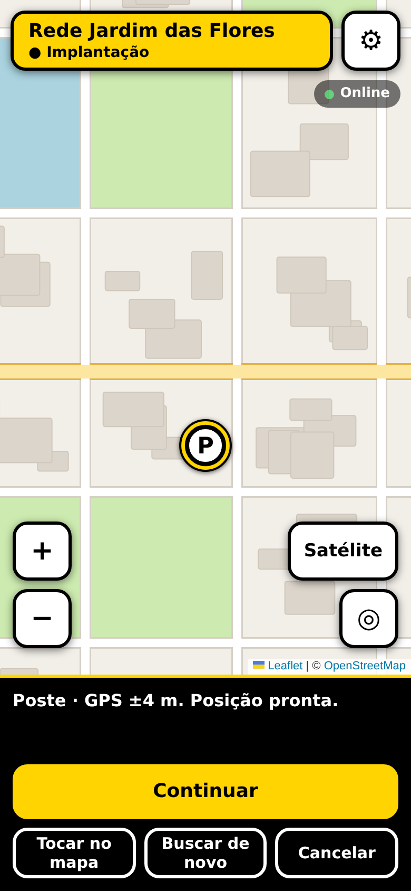<br><b>Marcar um poste</b><br><sub>GPS ±4 m: posição pronta</sub></td>
    <td align="center" width="25%">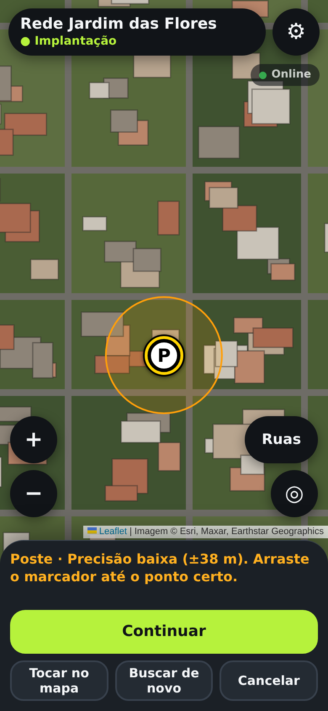<br><b>GPS impreciso</b><br><sub>Acima de 15 m, o app avisa e abre o satélite para ajustar</sub></td>
    <td align="center" width="25%">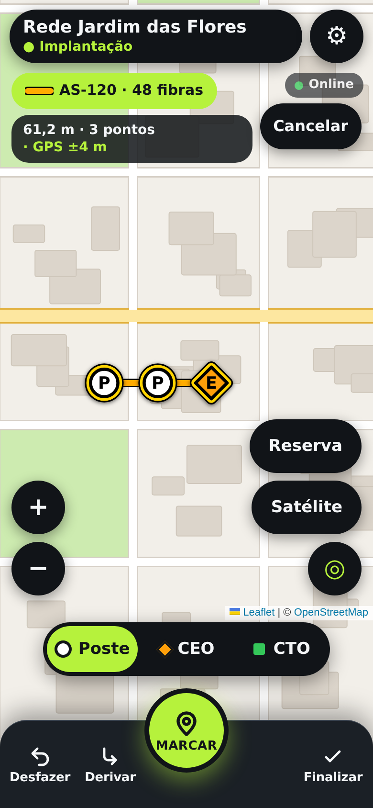<br><b>Lançar o tronco</b><br><sub>Poste, CEO ou CTO a cada ponto, no botão MARCAR</sub></td>
    <td align="center" width="25%">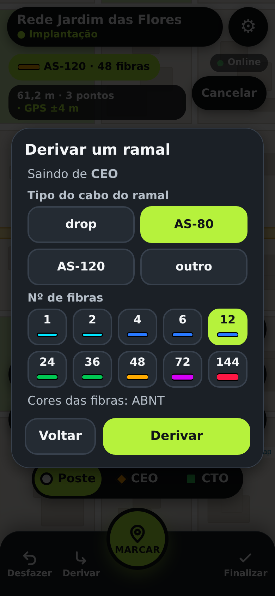<br><b>Derivar um ramal</b><br><sub>Tipo e fibras do ramal, a partir da CEO</sub></td>
  </tr>
  <tr>
    <td align="center">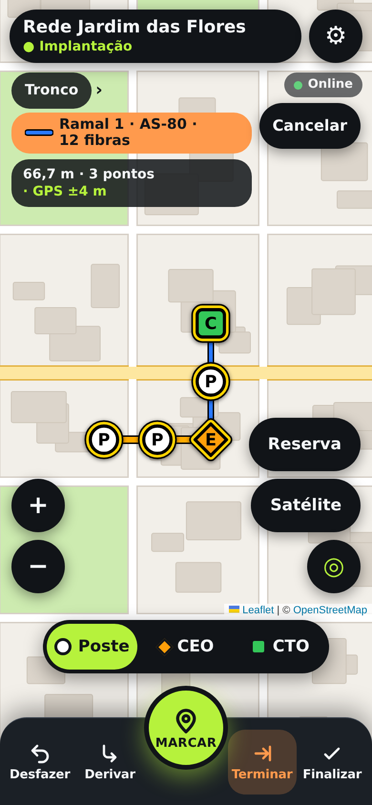<br><b>Ramal em andamento</b><br><sub>Sai da CEO e vai até a CTO</sub></td>
    <td align="center">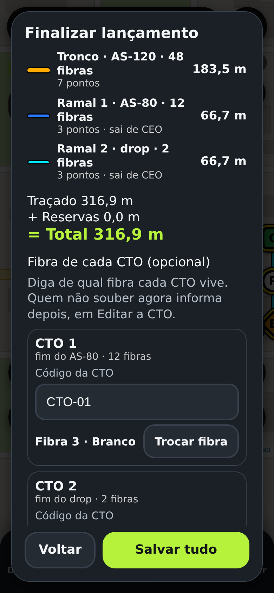<br><b>Finalizar</b><br><sub>Tronco, ramais e a fibra de cada CTO</sub></td>
    <td align="center">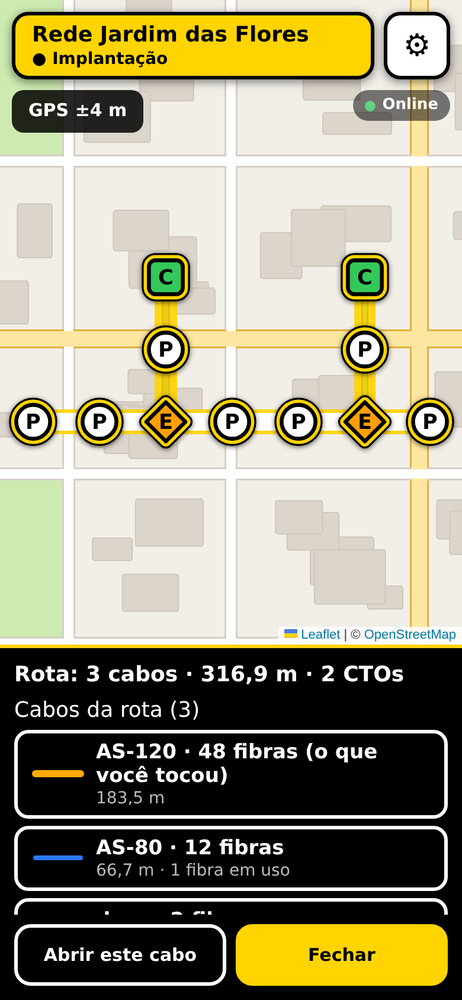<br><b>Rota acesa</b><br><sub>Tocar num cabo mostra a rede toda, ligada</sub></td>
    <td align="center">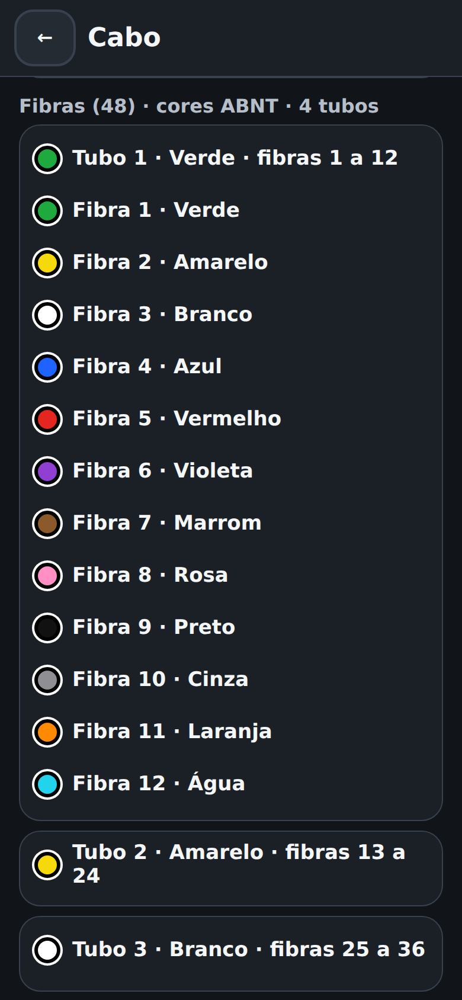<br><b>Fibras do cabo</b><br><sub>Cores ABNT, por tubo</sub></td>
  </tr>
</table>

### Primeiro acesso: sem aprovação, nada abre

<table>
  <tr>
    <td align="center" width="33%">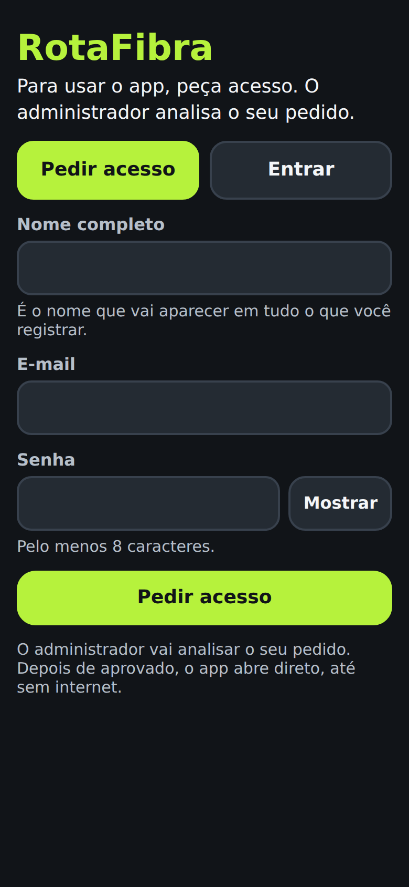<br><b>Pedir acesso</b><br><sub>É a primeira tela de todo aparelho novo: o mapa nem abre</sub></td>
    <td align="center" width="33%">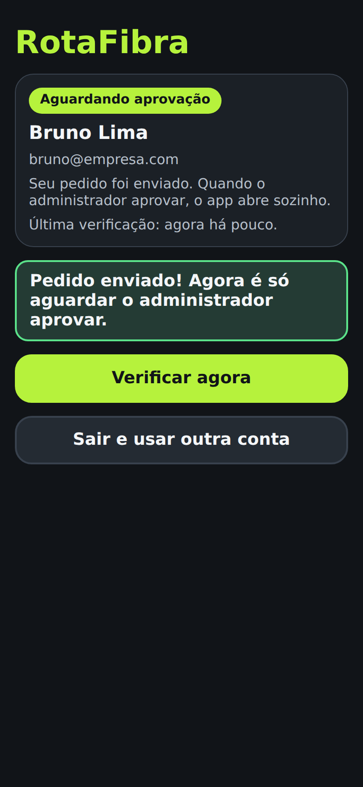<br><b>Aguardando aprovação</b><br><sub>Confere sozinha e abre o app quando o administrador aprova</sub></td>
    <td align="center" width="33%">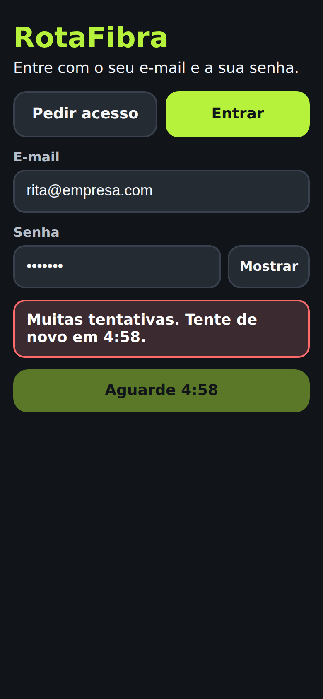<br><b>Limite de tentativas</b><br><sub>5 erros seguidos travam o aparelho por alguns minutos</sub></td>
  </tr>
</table>

### Dois temas de cor

Cada pessoa escolhe em *Ajustes › Aparência* (vale só para o aparelho dela). O desenho é o mesmo; o mapa fica claro nos dois.

<table>
  <tr>
    <td align="center" width="25%">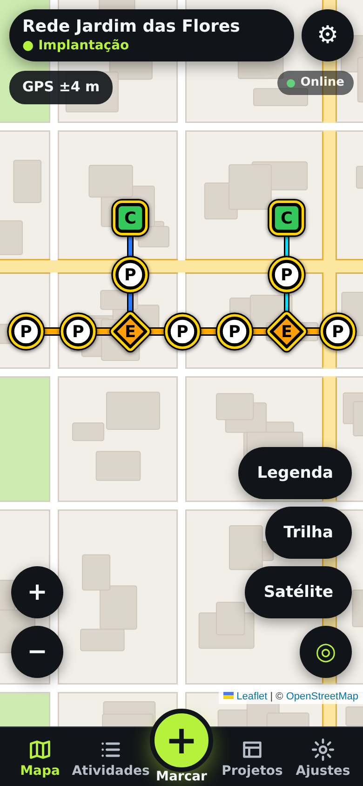<br><b>Polegar</b><br><sub>Grafite e verde-limão: contraste alto, bom ao sol</sub></td>
    <td align="center" width="25%"><br><b>Polegar</b><br><sub>Lançando o cabo com o polegar</sub></td>
    <td align="center" width="25%">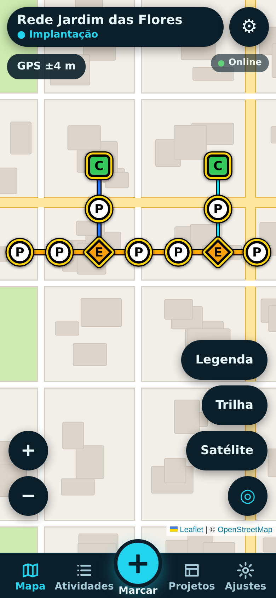<br><b>Fibra</b><br><sub>Azul-petróleo e ciano: suave, ótimo à noite</sub></td>
    <td align="center" width="25%">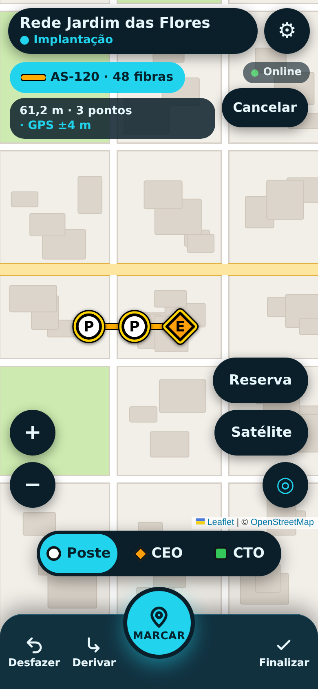<br><b>Fibra</b><br><sub>Mesmo lançamento no outro tema</sub></td>
  </tr>
</table>

### No painel do escritório (computador)

<p align="center">
  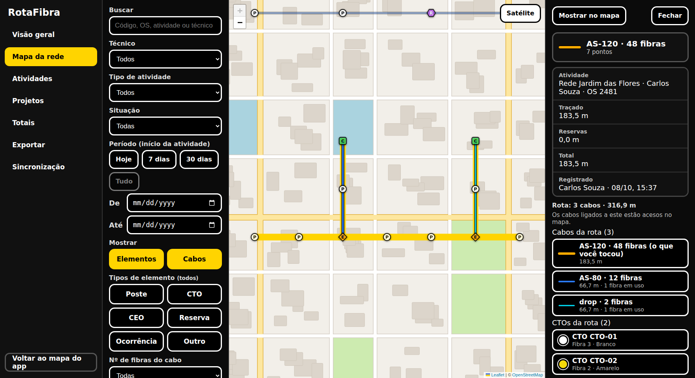<br>
  <sub><b>Mapa da rede:</b> a rota acesa, os cabos ligados e a fibra de cada CTO</sub>
</p>

<table>
  <tr>
    <td align="center" width="50%">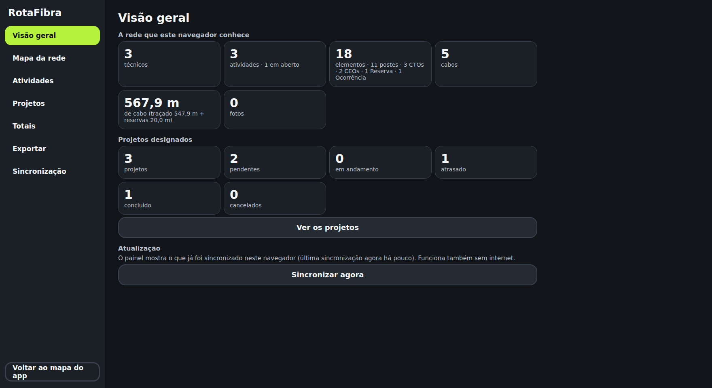<br><b>Visão geral</b><br><sub>Rede e projetos designados</sub></td>
    <td align="center" width="50%">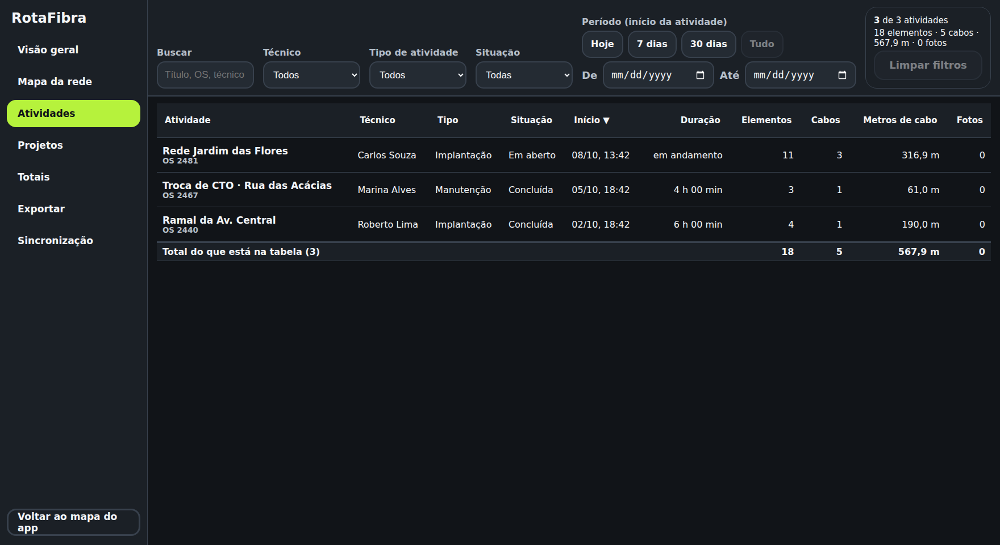<br><b>Atividades</b><br><sub>Tabela com filtros e totais</sub></td>
  </tr>
</table>

## Como funciona

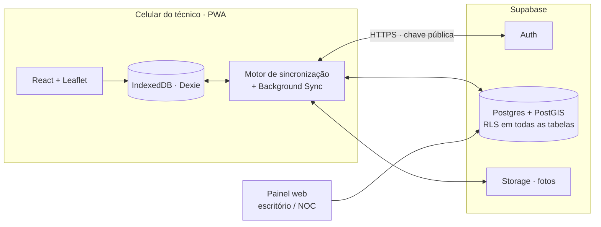

- **Local primeiro:** toda gravação vai para o IndexedDB; a interface lê de lá.
- **Reenviar nunca duplica:** todo registro nasce com um UUID no aparelho e o envio é um *upsert* por `id`.
- **Quem pode o quê** é decidido no servidor (RLS): técnico lê a rede toda mas só altera o que é dele; escritório só lê; administrador altera tudo e aprova pessoas.
- **Conflitos:** vale a alteração com `updated_at` mais recente; a atrasada e diferente vai para `sync_conflicts`. Relógio adiantado é limitado a "agora + 5 min".
- **Offline por inteiro:** o service worker guarda o app e os mapas já visitados (com limite de entradas), e envia os pendentes quando a internet volta.

## Stack

| Camada | Tecnologias |
|---|---|
| App | [Vite](https://vite.dev), [React](https://react.dev) 19, TypeScript (strict) |
| Mapa | [Leaflet](https://leafletjs.com) + react-leaflet; OpenStreetMap (ruas) e Esri World Imagery (satélite), com atribuição |
| Dados locais | [Dexie.js](https://dexie.org) (IndexedDB) |
| PWA | vite-plugin-pwa + Workbox (service worker próprio com envio em segundo plano) |
| Medidas e arquivos | Turf.js (`@turf/length`, `@turf/distance`), `@tmcw/togeojson`, JSZip, geração própria de KML |
| Backend | [Supabase](https://supabase.com): Auth, Postgres + PostGIS, Storage |
| Testes | Vitest (lógica, sincronização, KML, banco com Postgres e PostgREST reais) |
| Publicação | GitHub Actions + GitHub Pages |

## Começando

### Pré-requisitos

- [Node.js](https://nodejs.org) 22 ou mais novo e npm.

### Instalar e rodar

```bash
git clone https://github.com/RicardoMedeiros1/ftthfist.git
cd ftthfist
npm ci
npm run dev
```

O servidor sobe em **HTTPS na rede local** (certificado autoassinado), porque a geolocalização do celular exige contexto seguro. Para testar no aparelho, conecte-o ao mesmo Wi-Fi, abra o endereço `Network` mostrado no terminal e aceite o aviso do certificado.

### Variáveis de ambiente (opcional)

Sem Supabase, o app funciona **só no aparelho** (sem conta e sem sincronização). Para ligar o servidor, crie um `.env.local` (já ignorado pelo Git):

```bash
VITE_SUPABASE_URL=https://xxxx.supabase.co
VITE_SUPABASE_ANON_KEY=sb_publishable_...   # chave PÚBLICA (Publishable key); o nome da variável é o antigo "anon key"
```

> [!WARNING]
> Nunca use a **Secret key** (a antiga `service_role`, começa com `sb_secret_`) no app, no GitHub ou em conversas: ela ignora todas as regras de acesso. Se for colada numa variável por engano, o build **falha** antes de publicar.

### Comandos

| Comando | O que faz |
|---|---|
| `npm run dev` | Servidor de desenvolvimento em HTTPS na rede local |
| `npm run build` | Verifica os tipos e gera o app em `dist/` |
| `npm run preview` | Serve o build gerado (para testar o PWA e o modo offline) |
| `npm test` | Roda os testes unitários e de lógica (Vitest) |
| `npm run test:db` | Testes do banco contra Postgres + PostgREST reais (ver [Testes](#testes)) |

## Backend (Supabase)

O esquema do banco, as regras de acesso e os testes ficam em [`supabase/`](supabase/README.md).

1. Crie um projeto no Supabase e ajuste a autenticação (cadastro ligado, confirmação de e-mail desligada, senha mínima de 8 caracteres).
2. Aplique as **15 migrations** de `supabase/migrations/`, **em ordem**, pelo SQL Editor ou pela CLI.
3. Confira com os scripts `supabase/conferir-*.sql` (cada linha deve dizer `OK`).
4. Crie o primeiro administrador (a conta dele precisa existir):

   ```sql
   update public.profiles set role = 'admin', active = true
   where id = (select id from auth.users where email = 'voce@empresa.com');
   ```

5. Daí em diante, aprovar pessoas e mudar papéis é feito dentro do app (Configurações → Administração → Pessoas).

O passo a passo completo, com os cuidados de cada etapa, está em [`supabase/README.md`](supabase/README.md).

## Publicação

O workflow [`deploy.yml`](.github/workflows/deploy.yml) publica no **GitHub Pages** a cada push na `main`: instala, roda `npm test`, gera o build e faz o deploy.

1. Em *Settings → Pages*, escolha **GitHub Actions** como fonte.
2. Em *Settings → Secrets and variables → Actions → Variables*, crie `VITE_SUPABASE_URL` e `VITE_SUPABASE_ANON_KEY` (chave **pública**; são variáveis, não segredos).
3. O endereço fica em `https://<usuário>.github.io/<repositório>/`; a base (`BASE_PATH`) é ajustada sozinha.

O número da versão publicada aparece em *Configurações*, para conferir se o celular já atualizou.

> [!NOTE]
> O GitHub Pages serve o app **já compilado** (HTML e JavaScript) numa URL de acesso aberto. Os dados continuam protegidos por login, aprovação e RLS: sem conta ativa, o app nem abre e o servidor não entrega nada da rede.

## Testes

```bash
npm test
```

Cobrem metragem, filtro da trilha, KML/GeoJSON, backup, sincronização (com um servidor falso), regras de propriedade, lançamento de cabo (inclusive com ramais), fibras e rotas, entre outros.

Os **testes do banco** (`npm run test:db`) validam RLS, migrations, sincronização e o painel contra um Postgres com PostGIS e um PostgREST de verdade. Precisam das variáveis `TEST_DATABASE_URL` e `POSTGREST_BIN` (veja [`supabase/README.md`](supabase/README.md)); sem elas, são pulados.

O que conferir à mão, no celular e no computador, está em [`docs/guia-de-testes.md`](docs/guia-de-testes.md).

## Estrutura do projeto

```
src/
  db/          Dexie: esquema, tipos e migrações locais
  features/
    activities/   atividades (iniciar, concluir, editar)
    elements/     postes, CTOs, CEOs, reservas, ocorrências e fotos
    cables/       lançamento de cabo, ramais, fibras, ligações e rota
    map/          mapa, camadas, controles e GPS
    tracking/     trilha GPS
    reference/    camadas de referência (KML/KMZ)
    projects/     projetos designados e desenho do traçado
    panel/        painel web do escritório
    admin/        pessoas, alterações e conflitos
    account/      conta, login e papéis
    sync/         motor de sincronização e envio em segundo plano
    export/       backup, KML/KMZ e GeoJSON
    settings/     configurações
  lib/         funções puras (geo, imagem, rotas, propriedade)
  components/  interface compartilhada
  sw.ts        service worker (offline e Background Sync)
supabase/
  migrations/  esquema, RLS e regras de conflito (15 arquivos SQL)
  tests/       testes do banco
docs/          guias de cada área
```

## Documentação

| Guia | Assunto |
|---|---|
| [`docs/fibras.md`](docs/fibras.md) | Cores ABNT/TIA-598, ligação de cabos, fibra da CTO, rota acesa e lançamento de rede com ramais |
| [`docs/projetos.md`](docs/projetos.md) | Projetos designados, desenho do traçado e como o técnico os recebe |
| [`docs/painel-web.md`](docs/painel-web.md) | Painel do escritório: mapa, tabelas, totais e exportações |
| [`docs/guia-de-testes.md`](docs/guia-de-testes.md) | O que conferir no celular e no computador |
| [`supabase/README.md`](supabase/README.md) | Preparar o banco, migrations, papéis e verificação |
| [`CLAUDE.md`](CLAUDE.md) | Contexto, modelo de dados e regras do projeto |

## Status e próximos passos

- [x] **Fase 1 · Campo (offline):** atividades, elementos, cabos, fotos, trilha, referências, backup e exportação.
- [x] **Fase 2 · Servidor:** contas com aprovação, sincronização, fotos, painel do escritório, administração, projetos com desenho, fibras e lançamento em árvore.
- [ ] **Fase 3 · Coletor:** serviço Node.js + TypeScript dentro da rede da empresa para ler dados da OLT (os campos `oltName` e `ponPort` da CTO já existem para isso). Ainda não iniciado.

Limites conhecidos:

- **Emenda por fibra** (qual fibra do cabo A emenda com qual do cabo B) ainda não existe: as ligações são entre cabos.
- No **iPhone** não há envio com o app fechado (o navegador não oferece Background Sync); os dados sobem ao abrir o app.
- Sem e-mail configurado (SMTP próprio) no Supabase, "esqueci minha senha" não funciona; o administrador recria o acesso.

## Segurança

- A chave do app é só a **pública**; o acesso é decidido por **RLS** em todas as tabelas, no servidor.
- O banco **nunca apaga linhas** (sem `DELETE`): a exclusão é lógica.
- O dono de um registro não muda, e o servidor grava quem alterou o quê quando o administrador edita dados de outra pessoa.
- Cadastro novo nasce **pendente**: sem aprovação, a pessoa não lê nem grava nada.
- Não coloque chaves, senhas ou tokens (Supabase, OLT) em código, issues ou conversas.
- O projeto é de uso privado: não publique cópias, forks ou trechos do código ou dos dados sem autorização do titular.

## Contribuindo

Só contribui quem foi autorizado pelo titular do projeto.

1. Faça uma branch a partir da `main`.
2. Mantenha os commits pequenos e descritivos.
3. Interface em português do Brasil; código em inglês.
4. Rode `npm test` e `npm run build` antes de enviar.
5. Respeite os [princípios](#princípios), principalmente offline-first, botões de 48 px e exclusão lógica.

## Licença

**Software proprietário e privado. Todos os direitos reservados.** © 2026 RicardoMedeiros1.

Este projeto não é de código aberto. Ninguém pode usar, copiar, modificar, distribuir, hospedar para terceiros ou publicar o código, os dados ou a documentação sem autorização prévia e por escrito do titular. O acesso ao repositório (inclusive por convite, fork ou cópia local) não concede licença nem direito algum sobre o software. Os termos completos estão em [`LICENSE`](LICENSE).
